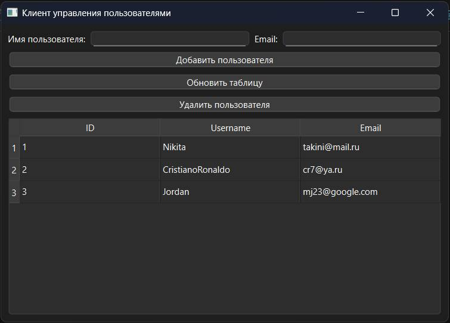
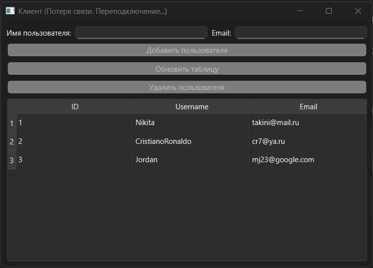

Клиентская часть тестового задания в ООО СТЦ

Клиент для отправки запросов серверу с БД. Ждет подключения к серверу для работы. Написан с помощью QWidget. В качестве протокола обмена выбран текстовый формат JSON. Работа с сетью организована стандартными средствами Qt(общение идет через QTcpSocket). Так выглядит интерфейс приложения. Таблица обновляется по таймеру.



Когда соединения с сервером нет - клиент закрывает текущее соединение и пытается переподключиться к нему также по таймеру. При этом кнопки с отправкой запросов на сервер некликабельны в этот момент.



## Технологический стек

*   **Язык**: C++17
*   **Фреймворк**: Qt 6.x (Core, QWidget, Network, Sql)
*   **Парсер JSON**: nlohmann/json (v3.11.3)
*   **Система сборки**: CMake 3.16+

---

## Инструкция по сборке и запуску

### Способ 1: Через Qt Creator (Рекомендуемый)
1. Откройте Qt Creator и выберите `File -> Open File or Project...`.
2. Выберите **корневой** `CMakeLists.txt`.
3. Настройте проект под комплект **Qt 6**.
4. Скомпилируйте и запустите (`Ctrl + R`).

### Способ 2: Через командную строку (Консоль)
```bash
# Клонируем репозиторий
git clone https://github.com
cd ваш_репозиторий

# Создаем папку сборки и компилируем
mkdir build && cd build
cmake ..
cmake --build .

# Запуск клиента
./TcpClientGui
```
---
